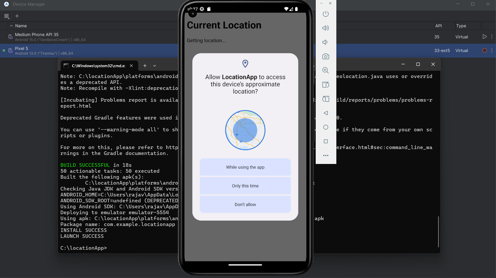
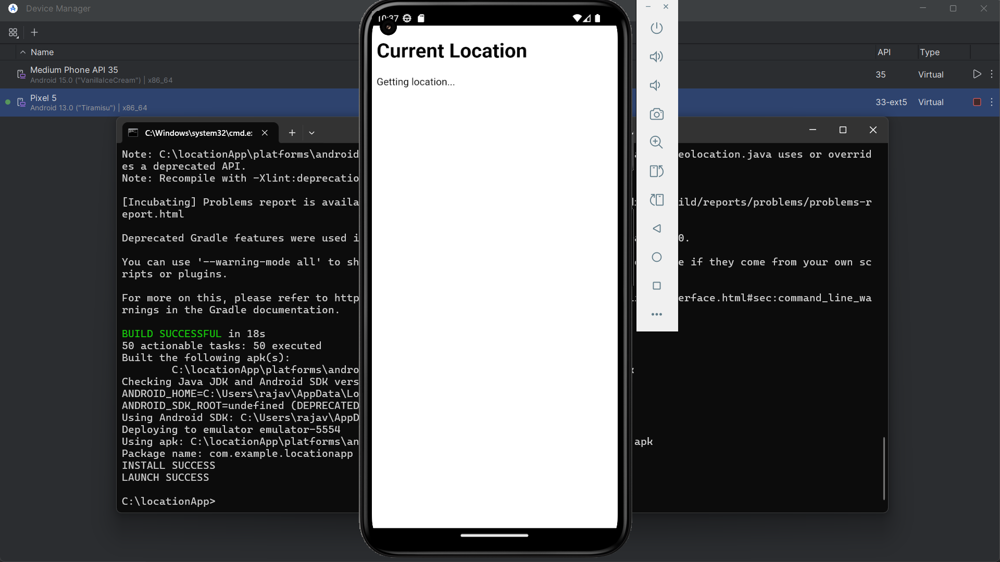
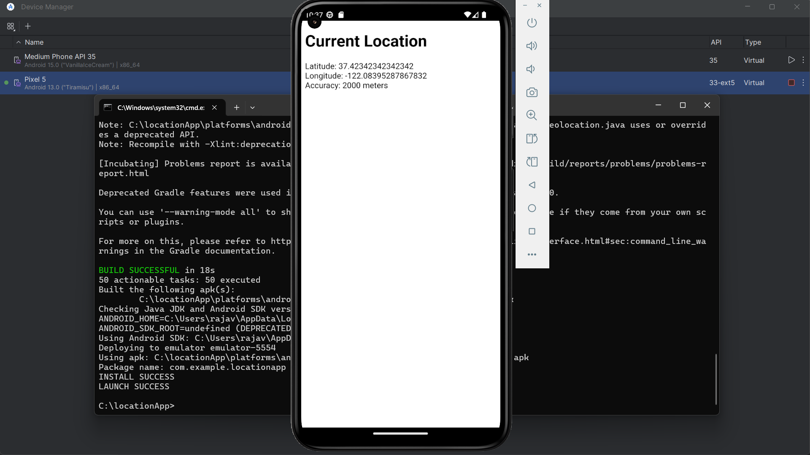

# Cordova Location App

This Android app is built with Apache Cordova and displays the **user's current location** (Latitude, Longitude, Accuracy).

## 📱 Screenshots






## 🔧 Tools Used
- Apache Cordova
- Java JDK
- Android Studio Emulator
- cordova-plugin-geolocation

## 🚀 How to Run
```bash
cordova platform add android
cordova plugin add cordova-plugin-geolocation
cordova build android
cordova run android
